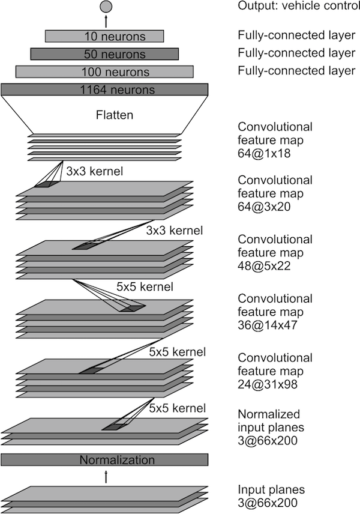

## Project: Behavioral Cloning

### Overview

The goal of this project is to teach a Convolutional Neural Network (CNN) to drive a car in a simulator. The simulator is provided by Udacity, it's based on Unity Engine, and uses real game physics to create a close approximation ro real driving.


When entering the simulator two options are given: Training Mode and Autonomous Mode.


In order to start collecting training data, we need to do the following:

1. Enter Training Mode in the simulator.
2. Start driving the car to get a feel for the controls.
3. When we're ready, hit the record button in the top right to start recording.
4. Continue driving for a few laps or till we feel like we have enough data.
5. Hit the record button in the top right again to stop recording.

If everything went correctly, we should see the following in the directory we selected:

1. `IMG` folder - it contains all the frames of our driving.
2. `driving_log.csv`- each row in this sheet correlates the images with the steering angle, throttle brake and speed of our car. We'll mainly be using the steering angle.


Now that we have training data, it's time to build and train a neural network!

We'll use [Keras](http://keras.io) to train a network to do the following:

1. Take in an image from the center camera of the car as input to our neural network.
2. Output a new steering angle for the car.
3. Save our model architectura as `model.json`and weights as `model.h5`.


#### Validating our network

We can validate our model by launching the simulator and entering autonomous mode.

The car just sit there until our Python server connects to it and provides it steering angles. To start the server, just run `python drive.py model.json`.

Once the model is up and running in `drive.py`, we should see the car move around the track!


### Multiple camera views and data augmentation

If we drive and record normal laps around the track, it might not be enough to train the model to drive properly.

Here’s the problem: if the training data is all focused on driving down the middle of the road, the model won’t ever learn what to do if it gets off to the side of the road. And probably when we run the model to predict steering angles, things won’t go perfectly and the car will wander off to the side of the road at some point.

To solve the recovery issue, the simulator provides images of three cameras into the car: center, left and right.

What we'll do is to map recovery paths from each camera. For example, if we train the model to associate a given image from the center camera with a left turn, then we could also train the model to associate the corresponding image from the left camera with a somewhat softer left turn. And we could train the model to associate the corresponding image from the right camera with an even harder left turn.

In that way, we can simulate our vehicle being in different positions, somewhat further off the center line. To read more about this approach, see this [paper by NVIDIA](http://images.nvidia.com/content/tegra/automotive/images/2016/solutions/pdf/end-to-end-dl-using-px.pdf) or this post by [Vivek Yadav](https://chatbotslife.com/using-augmentation-to-mimic-human-driving-496b569760a9#.rk62yvsgs)

We also use brightness augmentation, changing the brightness of images to simulate day and night conditions. To do it, we generate images with different brightness by first converting images to HSV, scaling up or down the V channel and converting back to the RGB channel.

Another transformation we use is to flip images randomly, and change the sign of the predicted steering angle, to simulate driving in the opposite direction.


***

### The project

To do the project, I created a python package [model](https://github.com/mpuig/CarND-Behavioral-Cloning/tree/master/model) which wraps all the model functionallities, and allows to use different network architectures easily. The jupyther notebook [CarND-Behavioral-Cloning.ipynb](CarND-Behavioral-Cloning.ipynb) has been used to test the package functions, to visualize the results, and to execute the training processes. For example, to train the Nvidia model, it's three lines of code:

```
   from model.nvidia import NvidiaModel
   nvidia = NvidiaModel()
   nvidia.train_model(epochs=5, batch_size=256)
```

The `train_model` method, launches the keras training process, and it saves the results of each epoch to the directory `out`, using the pattern `model_{name}_{epoch}.json` for the model and `model_{name}_{epoch}.h5` for the weights. The training process uses the keras `fit_generator` method. This method uses a batch-by-batch python generator to generate data. The generator is run in parallel to the model, for efficiency, and it allows to do real-time data augmentation on images on CPU in parallel to training the model on GPU.

The `fit_generator` uses keras callbacks to save the model files, and to stop the training if the validation loss doesn't improve for 3 consecutive epochs.

To launch the training process, and also to evaluate the step-by-step functions, I've used the python notebook [CarND-Behavioral-Cloning.ipynb](CarND-Behavioral-Cloning.ipynb). The results can be consulted there.

After several tests, the best results has been achived using a `samples_per_epoch` value of batch_size*200 (equivalent to 256*200, by default) and `epochs=15`


When the training process is done, the simulation can be launched using the command:

```
   python drive.py ./out/filename.json
```

The `drive.py` has been adapted to recognize the name of the model from the filename, and depending on the model, it applies a different preprocessing to the images from the simulator.

Using the modular architecture, three different network architectures has been implemented to test how they perform with the simulator:

1. NVIDIA: based on [NVIDIA paper](http://images.nvidia.com/content/tegra/automotive/images/2016/solutions/pdf/end-to-end-dl-using-px.pdf)
2. Custom: based on NVIDIA, changing image sizes and a few other parameters.
3. Carputer: based on [Carputer](https://github.com/otaviogood/carputer)

After a lot of tests, the best results are obtained using the NVIDIA architecture. In fact, the other models weren't able to finish the simulation.

### The NVIDIA CNN architecture

We train the weights of our network to minimize the mean-squared error between the steering command output by the network, and either the command of the human driver or the adjusted steering command.

The next image shows the network architecture, which consists of 9 layers, including a normalization layer, 5 convolutional layers, and 3 fully connected layers. In the original NVIDIA network, the input image is split into YUV planes and passed to the network. For this project I used RGB.



The first layer of the network performs image normalization. The convolutional layers are designed to perform feature extraction, and are chosen empirically through a series of experiments that vary layer configurations. Next it uses strided convolutions in the first three convolutional layers with a 2×2 stride and a 5×5 kernel, and a non-strided convolution with a 3×3 kernel size in the final two convolutional layers.

The five convolutional layers are followed with three fully connected layers, leading to a final output control value which is the inverse-turning-radius. The fully connected layers are designed to function as a controller for steering.

### Run

1. [Download the sample dataset for track 1](https://d17h27t6h515a5.cloudfront.net/topher/2016/December/584f6edd_data/data.zip).

2. Clone the project and install the required packages (based on Anaconda).


  ```
     git clone https://github.com/mpuig/CarND-Behavioral-Cloning
     cd CarND-Behavioral-Cloning
     conda env create -f environment.yml
     source activate CarND-Behavioral-Cloning
  ```

3. Install Tensorflow following the instructions from this link https://www.tensorflow.org/get_started/os_setup

  ```
     # Ubuntu/Linux 64-bit, GPU enabled, Python 3.5
     # Requires CUDA toolkit 8.0 and CuDNN v5. For other versions, see "Installing from sources" below.
     $ export TF_BINARY_URL=https://storage.googleapis.com/tensorflow/linux/gpu/tensorflow_gpu-0.12.1-cp35-cp35m-linux_x86_64.whl
     pip install --ignore-installed --upgrade $TF_BINARY_URL

     # Mac OS X, CPU only, Python 3.4 or 3.5:
     export PIP_REQUIRE_VIRTUALENV=false
     export TF_BINARY_URL=https://storage.googleapis.com/tensorflow/mac/cpu/tensorflow-0.12.1-py3-none-any.whl
     pip install --ignore-installed --upgrade $TF_BINARY_URL
  ```

4. Install Keras


  ```
     pip install keras
  ```

5. Launch the jupyter notebook


  ```
     jupyter notebook CarND-Behavioral-Cloning.ipynb
  ```

6. Go to  http://localhost:8888/notebooks/CarND-Behavioral-Cloning.ipynb in your browser and run all the cells. Everything should execute without error.

    The initial results of the training is as follows:

    ```
    Epoch 1/15
    50944/51200 [============================>.] - ETA: 1s - loss: 0.0888
    Epoch 00000: saving model to ./out/model_nvidia_00.json
    Epoch 00000: saving model to ./out/model_nvidia_00.h5
    51200/51200 [==============================] - 231s - loss: 0.0886 - val_loss: 0.0176
    Epoch 2/15
    50944/51200 [============================>.] - ETA: 1s - loss: 0.0524
    Epoch 00001: saving model to ./out/model_nvidia_01.json
    Epoch 00001: saving model to ./out/model_nvidia_01.h5
    51200/51200 [==============================] - 225s - loss: 0.0524 - val_loss: 0.0180
    Epoch 3/15
    50944/51200 [============================>.] - ETA: 1s - loss: 0.0459
    Epoch 00002: saving model to ./out/model_nvidia_02.json
    Epoch 00002: saving model to ./out/model_nvidia_02.h5
    51200/51200 [==============================] - 223s - loss: 0.0460 - val_loss: 0.0186
    Epoch 4/15
    50944/51200 [============================>.] - ETA: 1s - loss: 0.0424
    Epoch 00003: saving model to ./out/model_nvidia_03.json
    Epoch 00003: saving model to ./out/model_nvidia_03.h5
    51200/51200 [==============================] - 225s - loss: 0.0424 - val_loss: 0.0184
    Epoch 5/15
    50944/51200 [============================>.] - ETA: 1s - loss: 0.0400
    Epoch 00004: saving model to ./out/model_nvidia_04.json
    Epoch 00004: saving model to ./out/model_nvidia_04.h5
    51200/51200 [==============================] - 231s - loss: 0.0400 - val_loss: 0.0193
    Epoch 6/15
    50944/51200 [============================>.] - ETA: 1s - loss: 0.0381
    Epoch 00005: saving model to ./out/model_nvidia_05.json
    Epoch 00005: saving model to ./out/model_nvidia_05.h5
    51200/51200 [==============================] - 227s - loss: 0.0380 - val_loss: 0.0204

    [...]

    ```

  Once I tested the generated models, the best result is the one on epoch3 (corresponds to 'model_nvidia_03.json`)

7. Launch the simulator and run autonomous driving with the command:


  ```
     python drive.py ./out/model_nvidia_03.json
  ```

***

### Conclusions

This project has been a daily challenge during some weeks. It has forced me to deeply understand some concepts that I vaguely knew about CNN, and it has been a good opportunity to use keras in a real project. The final results are not as good as I wished, but the simulator drives along the road and it doesn't go off :)

***

### Dependencies

This project requires **Python 3.5** and the following Python libraries installed:

- [Jupyter](http://jupyter.org/)
- [NumPy](http://www.numpy.org/)
- [SciPy](https://www.scipy.org/)
- [scikit-learn](http://scikit-learn.org/)
- [TensorFlow](http://tensorflow.org)
- [Keras](http://keras.io)
- [Matplotlib](http://matplotlib.org/)
- [Pandas](http://pandas.pydata.org/) (Optional)

***

### Aside notes

I've defined a useful [Makefile](Makefile) to facilitate the AWS management and files syncronization.
